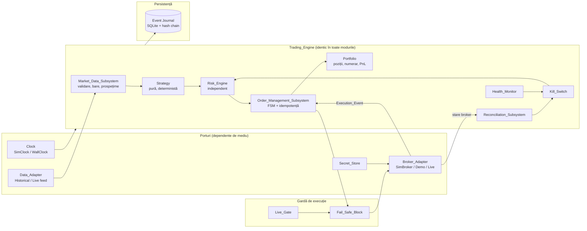
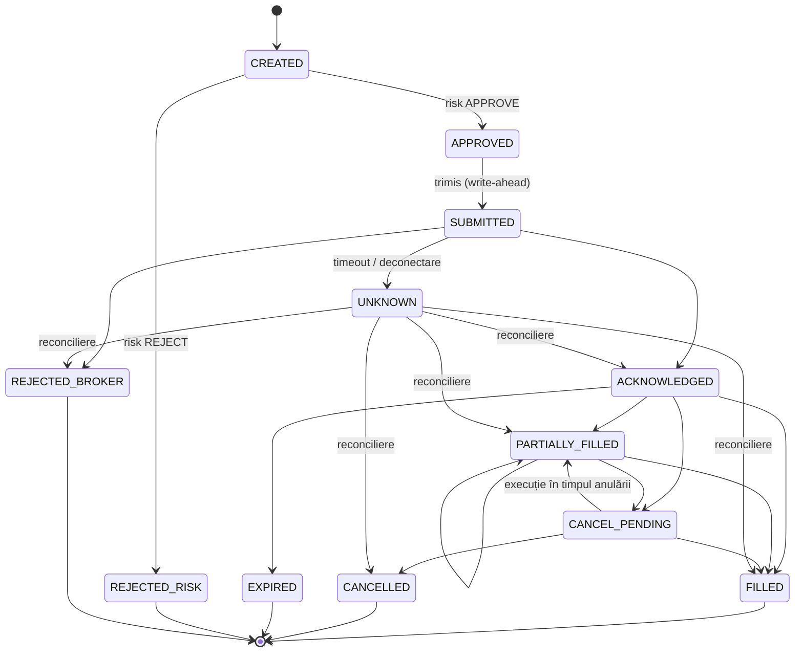

# Design Document

## Overview

`Quant_Trading_System` este o aplicație Python cu un singur proces și un nucleu event-driven determinist. Nucleul (`Trading_Engine`) nu cunoaște mediul în care rulează. Diferențele dintre Backtest, Shadow, Demo și Live sunt izolate în trei porturi: sursa de evenimente (`Data_Adapter`), executorul de ordine (`Broker_Adapter`) și ceasul (`Clock`).

Principii de design:

- **Un singur drum al deciziei**: `Market_Event → Strategy → Signal → Order_Intent → Risk_Engine → Order_Management_Subsystem → Broker_Adapter`. Nu există scurtături în niciun mod (Req 1, 12).
- **Siguranță prin construcție**: în `Initial_Stage`, codul care poate trimite ordine reale nu este nici măcar încărcat. Pe lângă respingerea logică există un `Fail_Safe_Block` separat (Req 2).
- **Determinism**: aritmetică `Decimal`, timp injectat, sămânță pseudoaleatoare înregistrată și fără stare globală (Req 6, 7, 17).
- **Event sourcing**: starea financiară (ordine, poziții, numerar, limite consumate) este reconstruită din jurnalul de evenimente. Jurnalul servește simultan ca `Recovery_Point` și ca bază pentru `Audit_Record` (Req 24, 26).
- **Fail closed**: orice dată lipsă, expirată sau neconcordantă duce la blocarea ordinelor noi, nu la presupuneri.

Brokerul și sursa de date rămân `Open_Decision` (Req 30). Designul livrează adaptoare complete pentru simulare (Backtest/Shadow) și un contract de adaptor broker testat cu un broker fals. Adaptorul Demo concret se scrie după alegerea brokerului.

## Decizia de stack tehnic (rezolvă Open_Decision „Stack tehnic”, Req 30.7)

| Domeniu | Alegere | Justificare |
|---|---|---|
| Limbaj | Python 3.13 | Instalat local; ecosistem statistic matur; orizontul de 5–60 min nu cere un limbaj de latență mică (Req 27.6) |
| Mediu și dependențe | `uv`, `pyproject.toml`, `uv.lock` cu versiuni fixate | Build reproductibil (Req 17) |
| Modele și configurație | `pydantic` v2 cu `extra="forbid"`, configurație TOML | Validare strictă, câmpuri necunoscute respinse (Req 17.1–17.2) |
| Bani și prețuri | `decimal.Decimal` (precizie 28, `ROUND_HALF_EVEN`); cantitățile rotunjite în jos la pasul instrumentului | Fără erori de rotunjire binară în limitele de risc |
| Calcul statistic | `numpy`, `polars` | Bootstrap, walk-forward, agregare bare |
| Persistență | SQLite în mod WAL, `synchronous=FULL` | Un singur fișier, tranzacții ACID, fără server de administrat |
| Integritate audit | Lanț SHA-256 (`hash_i = H(hash_{i-1} ‖ payload_i)`) | Detectează modificarea sau ștergerea (Req 24.4) |
| Secrete | Windows Credential Manager prin `keyring` | Fără secrete în fișiere (Req 23) |
| Teste | `pytest`, `hypothesis` (property-based) | Proprietăți de corectitudine (secțiunea Correctness Properties) |
| Calitate | `ruff`, `mypy --strict` | Erori de tip detectate înaintea rulării |
| Interfață operator | CLI (`typer`) | Nu este expus niciun endpoint de rețea în etapa inițială |

Fără cozi externe, microservicii sau containere: complexitatea operațională ar crește riscul fără beneficiu la această scară.

## Architecture



### Moduri și compunerea porturilor

| Mod | Data_Adapter | Broker_Adapter | Clock | Real_Order_Request posibilă |
|---|---|---|---|---|
| Backtest | `HistoricalReplay` | `SimBroker` | `SimClock` (avansat de evenimente) | Nu, fizic imposibil |
| Shadow | feed curent | `SimBroker` (execuție locală) | `WallClock` | Nu, fizic imposibil |
| Demo | feed curent | adaptor broker, endpoint demo | `WallClock` | Nu: endpoint-ul și contul sunt verificate ca demo |
| Live | feed curent | adaptor broker, endpoint live | `WallClock` | Doar după `Live_Gate` |

Compunerea se face într-un singur loc (`bootstrap.py`). Nucleul primește porturile prin constructor și nu importă niciodată un adaptor concret (Req 1.1, 1.2, 16.6).

### Bucla de evenimente

Un singur fir procesează evenimentele dintr-o coadă prioritizată cu cheia `(timestamp, prioritate_tip, secvență)`. Prioritatea versionată la egalitate de timp este: `Execution_Event` < `Market_Event` < `Timer` < `Command` (Req 7.1). Firul unic elimină condițiile de cursă: fiecare eveniment este aplicat atomic și scris în jurnal înaintea efectelor externe (write-ahead).

Adaptoarele I/O (feed, broker) rulează în fire separate. Ele doar pun evenimente în coadă și nu modifică starea. `Kill_Switch` este un `threading.Event` verificat sincron imediat înaintea fiecărei transmiteri. Astfel, timpul de blocare nu depinde de lungimea cozii (Req 14.1–14.2: maximum o secundă).

## Components and Interfaces

Toate interfețele sunt `typing.Protocol`. Signaturile de mai jos sunt contractul. Implementările concrete pot adăuga detalii interne, dar nu pot extinde contractul.

### Porturi

```python
class Clock(Protocol):
    def now(self) -> datetime: ...  # mereu UTC, timezone-aware


class DataAdapter(Protocol):
    source_id: str

    def stream(self) -> Iterator[MarketEvent]: ...  # Backtest: istoric; altfel: curent


class BrokerAdapter(Protocol):
    environment: Literal["sim", "demo", "live"]
    account_id: str

    def capabilities(self) -> BrokerCapabilities: ...
    def submit(self, req: OrderRequest) -> SubmitAck: ...  # idempotent pe client_order_id
    def cancel(self, client_order_id: str) -> CancelAck: ...
    def snapshot(self) -> BrokerSnapshot: ...  # ordine, execuții, poziții, numerar
    def events(self) -> Iterator[ExecutionEvent]: ...


class SecretStore(Protocol):
    def get(self, ref: SecretRef, requester: Identity, env: Environment) -> SecretValue: ...
```

`SecretValue` are `__repr__`/`__str__` care întorc `"***"` și nu poate fi serializat. Valoarea brută este accesibilă doar prin `.reveal()`, apelat exclusiv în interiorul adaptorului (Req 23.2).

### Market_Data_Subsystem (Req 5)

- `normalize(raw) -> MarketEvent` folosește aceeași schemă în toate modurile.
- `validate_bar(bar) -> BarVerdict` verifică `low ≤ min(open, close) ≤ max(open, close) ≤ high`, volum ≥ 0, câmpuri prezente și timp strict crescător per instrument. Barele invalide sunt excluse, iar motivul este jurnalizat (5.4).
- Deduplicarea folosește cheia canonică `(source_id, instrument, ts_source, seq)` (5.7).
- `FreshnessTracker` blochează `Order_Intent` pe instrument când `now - ts_receipt_last > freshness_threshold[instrument]` (5.5).
- Fiecare set de date are un manifest: sursă, interval, fus orar, calendar, ajustări corporative și SHA-256. Când suma de control nu corespunde, setul este invalidat (5.6, 5.8).

### Strategy (Req 6)

```python
class Strategy(Protocol):
    strategy_id: str
    version: str

    def on_bar(
        self, bar: Bar, view: HistoryView, state: StrategyState
    ) -> tuple[Signal, StrategyState]: ...
```

- Este o funcție pură: nu primește ceas, I/O, aleatorietate sau acces la portofoliu ori risc.
- `HistoryView` întoarce numai bare cu `ts_close ≤ bar.ts_close`. Orice acces la viitor ridică excepție, deci look-ahead-ul este imposibil prin construcție (7.2).
- `Signal` conține `action ∈ {ENTER_LONG, EXIT, NONE}`, `stop_price`, `reason_code`, `inputs` (valorile utilizate) și `rules_evaluated`. Datele invalide produc `NONE` cu un cod de motiv (6.3, 6.4).
- Strategia nu stabilește cantitatea. Ea propune doar direcția și nivelul de protecție, iar dimensionarea aparține `Risk_Engine` (12.2).
- Prima strategie de referință este un mean-reversion simplu pe bare de 15 minute (z-score față de media mobilă, cu ieșire la medie sau la stop). Ea servește la validarea pipeline-ului, nu ca promisiune de avantaj.

### Risk_Engine (Req 12, 13)

Primește `Order_Intent` (instrument, direcție, preț de referință, stop) împreună cu un `RiskContext` imuabil: numerar, poziții, PnL zilnic, PnL total, costuri estimate și starea `Kill_Switch`. Întoarce `RiskDecision ∈ {APPROVE(qty), REJECT(reason, value, limit)}`.

Dimensionarea și verificările se fac în ordine, iar prima încălcare oprește evaluarea:

1. `Kill_Switch` activ, mod nepermis, date expirate sau lipsă → `REJECT` (12.6).
2. Instrumentul sau tipul ordinului cere levier, short, futures sau CFD → `REJECT` (13.7).
3. `risk_per_unit = (entry - stop) + cost_per_unit_roundtrip`, cu `entry > stop` obligatoriu pentru long.
4. `qty = floor_to_step(min(risk_budget_trade / risk_per_unit, (cash - fixed_costs) / entry))`.
5. `qty < min_qty` sau `qty * risk_per_unit + fixed_costs > 0,50 EUR` → `REJECT` (13.2, 13.8).
6. `daily_loss_so_far + trade_risk > daily_limit` → `REJECT`. Se folosește pierderea zilnică realizată plus cea nerealizată, cu risc deschis cel mai defavorabil (13.3).
7. `total_loss_so_far + open_risk + trade_risk > 10 EUR` → `REJECT` (13.5).
8. Când cantitatea a fost redusă, pașii 5–7 se reevaluează pe cantitatea finală (12.7).

Comisioanele fixe minime pe ordin intră în pasul 5. Practic, orice broker cu comision minim de peste aproximativ 0,25 EUR pe ordin face imposibilă respectarea limitei de 0,50 EUR pe tranzacție dus-întors. Instrumentul devine automat neeligibil (4.7), ceea ce influențează direct alegerea brokerului.

Monitorizarea continuă, la fiecare `Market_Event` și `Execution_Event`:

- pierderea zilnică (realizată + nerealizată) ≥ limita zilnică → `Kill_Switch(scope=DAY)` (13.4);
- `equity + withdrawals - deposits ≤ 90 EUR` → `Kill_Switch(scope=CAPITAL_CONFIG, permanent=True)`. Acest kill switch se poate dezactiva doar printr-o configurație nouă de capital (13.6, 13.11, 28.4).

### Order_Management_Subsystem (Req 9, 10)

Mașina de stări a ordinului:



- Tranzițiile sunt definite într-un tabel static. O tranziție absentă din tabel este respinsă și jurnalizată, iar starea rămâne neschimbată (9.2, 9.4).
- Un ordin `UNKNOWN` îngheață instrumentul. Nu se trimit ordine noi pe el până la reconciliere (9.6).
- `client_order_id = Idempotency_Key = H(run_id, strategy_id, instrument, signal_seq)`. Cheia este deterministă, deci o retrimitere după repornire produce aceeași cheie, iar brokerul o deduplică (10.1, 10.2).
- Execuțiile sunt deduplicate după `(broker_exec_id)`, iar o execuție deja aplicată este ignorată și jurnalizată ca retransmisie (10.3, 10.5).
- Execuțiile parțiale actualizează `filled_qty`, `remaining_qty`, prețul mediu ponderat și costurile cumulate. Invariant: `filled + remaining = original` (9.3).

### Reconciliation_Subsystem (Req 11)

- Rulează la pornire, după reconectare, după fiecare `Execution_Event` (pentru instrumentul afectat) și periodic, la cel mult 60 de secunde în Demo/Live.
- Compară `BrokerSnapshot` cu proiecția internă: poziții, numerar și ordine deschise.
- O diferență peste toleranță blochează sincron instrumentul. Când diferența privește numerarul sau nu poate fi atribuită unui instrument, se activează `Kill_Switch` global, pentru că limitele de risc depind de numerar.
- Dacă snapshot-ul nu poate fi obținut complet, se activează `Kill_Switch` (11.6).
- Reluarea cere înregistrarea cauzei, a corecției, a aprobării operatorului și o reconciliere ulterioară reușită (11.7, 14.5, 14.8).

### Kill_Switch (Req 14)

- Domenii: `INSTRUMENT`, `DAY`, `GLOBAL`, `CAPITAL_CONFIG`. Un ordin trece doar dacă niciun domeniu aplicabil nu este activ.
- Starea este persistată în jurnal înaintea efectului. La repornire, kill switch-ul rămâne activ (26.1).
- Politica pentru ordinele deschise este configurabilă (`keep` | `cancel`), cu valoarea implicită `keep` (14.3, 14.7).
- Recepția execuțiilor, reconcilierea și auditul continuă cât timp kill switch-ul este activ (14.4).

### Live_Gate și Fail_Safe_Block (Req 2, 15)

Trei bariere independente; oricare dintre ele, singură, ajunge pentru a bloca Live:

1. **Barieră de build/încărcare**: adaptoarele live sunt în pachetul opțional `qts_live`, care nu este instalat în `Initial_Stage`. Fabrica de adaptoare refuză `environment="live"` dacă `project_stage != "post_initial"` în `stage.lock`, fișier semnat și separat de configurație.
2. **Validare la pornire**: o configurație cu endpoint sau cont live în `Initial_Stage` este refuzată (2.4). Lista de endpoint-uri cunoscute ca live per broker este versionată.
3. **Fail_Safe_Block**: un wrapper în jurul fiecărui `BrokerAdapter.submit` verifică imediat înaintea apelului de rețea că `adapter.environment` și `account_id` corespund configurației aprobate și că `Live_Gate.is_open()`. Verificarea este independentă de `Risk_Engine` și de `Order_Management_Subsystem` (2.6, 15.9).

`Live_Gate.is_open()` reevaluează de la zero toate condițiile 15.1–15.5. Activarea cere două confirmări CLI distincte, la cel mult 10 minute una de alta, cu autentificare locală (15.6, 15.7, 23.8). Orice repornire închide poarta (15.10).

### Health_Monitor (Req 25, 26.6)

Agregă stările pentru date, broker, reconciliere, risc, stocare, ceas și audit. Ceasul este comparat periodic cu NTP; în Demo/Live, o deviație peste 500 ms suspendă ordinele noi. O componentă critică nesănătoasă activează `Kill_Switch(GLOBAL)`. Alertele sunt scrise într-o coadă persistentă (`alerts` în SQLite) cu reîncercare. Canalul inițial de livrare este consola/logul; un canal extern (de exemplu email sau Telegram) se adaugă ulterior ca adaptor.

### Research_Pipeline (Req 18–22, 29)

Rulează offline peste același `Trading_Engine` în modul Backtest:

- `PreRegistration`: metrica principală, `Promotion_Criteria`, spațiul parametrilor, numărul de variante, metoda de corecție, regimurile, multiplicatorii de stres și ferestrele walk-forward. Este salvată și hash-uită înaintea evaluării; evaluarea refuză să ruleze fără ea (19.8, 21.1, 21.8).
- `DataPartitioner`: împarte cronologic datele în `Development_Set` și `Out_Of_Sample_Set`. Un registru persistent marchează OOS ca „consumat” după prima evaluare; o a doua accesare a aceluiași OOS este refuzată (18.3, 18.6).
- `WalkForward`: minimum 5 ferestre, cu lungime, pas și recalibrare fixate în pre-înregistrare.
- `Bootstrap`: stationary bootstrap pe rezultatele nete per tranzacție (păstrează autocorelația), cu ≥10.000 de reeșantionări și sămânță înregistrată. Produce distribuțiile pentru PnL net, drawdown maxim, cea mai lungă serie de pierderi și probabilitatea atingerii limitei de 10 EUR (19.3, 19.4).
- `Stress`: costuri ×1,0 / ×1,5 / ×2,0 și latență la valoarea de bază și la valorile de stres (20.3, 20.4).
- `Regimes`: volatilitate realizată (tercile fixate pe `Development_Set`) × trend (pantă normalizată), cu rezultate raportate pe regim (20.1, 20.2).
- `MultipleTesting`: Deflated Sharpe Ratio pentru setul de variante plus Holm–Bonferroni pe p-valorile bootstrap. Metoda se alege în pre-înregistrare (21.2, 21.5).
- `Robustness`: compară rezultatul cu vecinătatea parametrilor ±1 pas pe fiecare axă; dacă mai puțin de jumătate din vecini sunt acceptabili, strategia este respinsă (19.5, 19.6). Testul de eliminare a celor mai mari N câștiguri acoperă 21.6.
- `Report`: valori brute, costuri pe categorii, valori nete, ipoteze, incertitudine și avertismentul că profitul nu este garantat. Un raport cu o metrică lipsă este marcat incomplet (29).

### Complete_Cost_Model (Req 8)

```python
class CostModel(Protocol):
    version: str

    def estimate(self, order: OrderSpec, quote: Quote, ctx: CostContext) -> CostBreakdown: ...
    def realize(self, fill: Fill, quote_at_decision: Quote, ctx: CostContext) -> CostBreakdown: ...


@dataclass(frozen=True)
class CostBreakdown:
    spread: Decimal
    commission: Decimal
    slippage: Decimal
    latency: Decimal
    fx_conversion: Decimal
    taxes: Decimal

    @property
    def total(self) -> Decimal: ...
```

- **Spread**: jumătate din spreadul cotat la decizie. În lipsa cotației bid/ask (date doar pe bare), se folosește un spread configurat per instrument și oră.
- **Comision**: tabel per broker (procent, minim, maxim, taxe de bursă), versionat.
- **Slippage**: `k × σ_bar × sqrt(qty / ADV)` plus un minim fix în tick-uri.
- **Latență**: execuția simulată are loc la prețul de la `t_decizie + latency`, nu la închiderea barei. În Backtest, ordinul generat la închiderea barei *t* se execută la deschiderea barei *t+1*, ajustată cu spread și slippage.
- **Conversie FX**: spreadul de conversie al brokerului, când moneda instrumentului diferă de EUR.
- **Taxe**: câmp configurat. Valoarea pentru România se confirmă de operator și nu este hardcodată (notă de conformitate). Reportarea separă rezultatul înainte și după taxe.
- O componentă obligatorie neconfigurată face ca `estimate` să ridice `CostModelIncomplete`, iar evaluarea este invalidată (8.3).

`SimBroker` folosește același `CostModel` pentru Backtest și Shadow. În Demo, costurile efective raportate de broker sunt comparate cu estimarea, iar abaterea este raportată (22.4).

## Data Models

Toate modelele sunt `pydantic` imuabile (`frozen=True`, `extra="forbid"`). Timpii sunt `datetime` UTC; banii sunt `Decimal`.

```python
class Instrument(BaseModel):
    symbol: str
    venue: str
    asset_class: Literal["etf", "stock", "fx", "commodity_etp", "crypto"]
    currency: str
    tick_size: Decimal
    qty_step: Decimal
    min_qty: Decimal
    min_notional: Decimal
    fractional: bool
    calendar_id: str
    requires_leverage: bool = False
    shortable_used: bool = False


class MarketEvent(BaseModel):
    source_id: str
    instrument: str
    ts_source: datetime
    ts_receipt: datetime
    seq: int | None
    kind: Literal["bar", "quote", "trade"]
    payload: Bar | Quote | Trade


class Bar(BaseModel):
    instrument: str
    ts_open: datetime
    ts_close: datetime
    interval_min: int  # 5..60 (Req 4.5)
    open: Decimal
    high: Decimal
    low: Decimal
    close: Decimal
    volume: Decimal


class Signal(BaseModel):
    signal_id: str
    strategy_id: str
    strategy_version: str
    instrument: str
    ts: datetime
    action: Literal["ENTER_LONG", "EXIT", "NONE"]
    stop_price: Decimal | None
    reason_code: str
    inputs: dict[str, Decimal]
    rules_evaluated: list[str]
    config_snapshot_id: str
    data_ids: list[str]


class OrderIntent(BaseModel):
    intent_id: str
    signal_id: str
    instrument: str
    side: Literal["BUY", "SELL"]
    ref_price: Decimal
    stop_price: Decimal | None
    order_type: Literal["MARKET", "LIMIT"]


class Order(BaseModel):
    client_order_id: str
    intent_id: str
    instrument: str
    side: str
    qty: Decimal
    filled_qty: Decimal
    avg_fill_price: Decimal | None
    costs: CostBreakdown
    state: OrderState
    broker_order_id: str | None
    version: int


class ExecutionEvent(BaseModel):
    broker_exec_id: str
    client_order_id: str
    kind: ExecKind
    qty: Decimal | None
    price: Decimal | None
    commission: Decimal | None
    ts_broker: datetime
    ts_receipt: datetime


class AuditRecord(BaseModel):
    seq: int
    ts: datetime
    type: str
    correlation_id: str
    component: str
    component_version: str
    actor: str
    outcome: str
    payload: dict
    prev_hash: str
    hash: str


class StrategyArtifact(BaseModel):
    artifact_id: str  # hash peste tot conținutul de mai jos
    strategy_id: str
    strategy_version: str
    code_hash: str
    params: dict
    risk_config_hash: str
    cost_model_version: str
    universe_version: str
    partitions: list[DataPartition]
    preregistration_hash: str
    validation_report_hash: str | None
```

### Persistență (SQLite)

| Tabel | Conținut | Note |
|---|---|---|
| `journal` | Toate evenimentele de domeniu, append-only | `seq` monoton, `prev_hash`, `hash` (Req 24.4) |
| `orders`, `positions`, `cash`, `risk_state`, `kill_switch` | Proiecții reconstruibile din `journal` | Actualizate în aceeași tranzacție cu jurnalul |
| `checkpoints` | Recovery_Point: `journal_seq`, hash-ul proiecțiilor | Validat la pornire (Req 26.2) |
| `idempotency` | `client_order_id`, `broker_exec_id` aplicate | Cheie unică (Req 10) |
| `datasets`, `oos_registry`, `artifacts`, `decisions`, `approvals` | Cercetare, promovare, Open_Decision | Imuabile după scriere |
| `alerts` | Coadă de alerte cu reîncercare | Req 25.6 |

Fiecare eveniment este aplicat într-o singură tranzacție SQLite (jurnal + proiecții). Ordinea pentru transmiterea unui ordin este: `APPROVED → (journal: SUBMITTED, commit) → broker.submit()`. Dacă procesul cade între commit și răspuns, la repornire ordinul este `SUBMITTED` fără confirmare. Reconcilierea caută `client_order_id` la broker, iar cheia deterministă împiedică dublarea (10.2, 11.1).

### Configurație

Un fișier TOML per mediu (`config/backtest.toml`, `shadow.toml`, `demo.toml`, `live.toml`), validat cu pydantic. Secretele apar numai ca referințe (`secret_ref = "qts/demo/broker_key"`). La pornire, configurația efectivă (fără secrete) împreună cu `git rev-parse HEAD`, hash-ul `uv.lock`, artefactul, datele și sămânța devin un `Configuration_Snapshot` hash-uit. Fără snapshot, procesarea nu pornește (17.3, 17.7).

`stage.lock` (separat de configurație, versionat în git) conține `project_stage = "initial"`. Ieșirea din etapa inițială se face doar printr-o comandă CLI dedicată, cu dublă confirmare și înregistrare de aprobare. Nu face parte din acest spec.

## Structura proiectului

```
pyproject.toml  uv.lock  stage.lock
config/                     # TOML per mediu, schema versionată
src/qts/
  core/        events.py  models.py  money.py  clock.py  engine.py  bus.py
  data/        adapter.py  normalize.py  validate.py  bars.py  freshness.py  manifest.py  csv_source.py
  strategy/    base.py  history_view.py  mean_reversion.py
  risk/        engine.py  limits.py  sizing.py  context.py
  oms/         fsm.py  manager.py  idempotency.py
  portfolio/   portfolio.py  pnl.py
  costs/       model.py  commission_tables.py
  broker/      adapter.py  sim.py  fail_safe.py  factory.py  fake.py
  recon/       reconciler.py
  safety/      kill_switch.py  live_gate.py  stage.py
  persistence/ db.py  journal.py  audit.py  recovery.py
  config/      schema.py  loader.py  snapshot.py
  secrets/     store.py
  health/      monitor.py  alerts.py
  research/    preregistration.py  partition.py  walk_forward.py  bootstrap.py
               stress.py  regimes.py  multiple_testing.py  robustness.py  report.py
  cli.py  bootstrap.py
tests/          unit/  property/  integration/  fixtures/
```

Pachetul `qts_live` (adaptoare live) nu există în acest spec. Este introdus doar după ieșirea din `Initial_Stage`.

## Error Handling

| Situație | Reacție | Cerință |
|---|---|---|
| Configurație invalidă sau incompletă | Refuz pornire, listă completă a abaterilor | 1.3, 17.2 |
| Endpoint/cont live în etapa inițială | Refuz pornire, Audit_Record | 2.4 |
| Bar invalid | Excludere bar, motiv jurnalizat, strategia primește `NONE` | 5.4, 6.4 |
| Date expirate | Blocare `Order_Intent` pe instrument | 5.5 |
| Cost model incomplet | Evaluare invalidată | 8.3 |
| Tranziție FSM invalidă | Respingere tranziție, stare păstrată, incident | 9.4 |
| Timeout la trimitere | Ordin `UNKNOWN`, instrument înghețat, reconciliere | 9.6, 11 |
| Gol de secvență în execuții | Suspendare ordin dependent, cerere snapshot | 10.4 |
| Diferență la reconciliere | Blocare instrument sau global, Audit_Record | 11.5 |
| Snapshot broker incomplet | `Kill_Switch(GLOBAL)` | 11.6 |
| Recovery_Point invalid | `Kill_Switch(GLOBAL)` în ≤1 s | 26.4 |
| Deviație ceas > 500 ms (Demo/Live) | Suspendare ordine noi | 26.6 |
| Lanț audit rupt | `Kill_Switch(GLOBAL)`, incident critic | 24.4 |
| Secret în ieșire | Blocare publicare, incident de securitate | 23.7 |
| Excepție neprevăzută în nucleu | Eveniment curent abandonat, `Kill_Switch(GLOBAL)`, stack trace fără secrete | fail closed |

Excepțiile din nucleu nu sunt înghițite. Fiecare tip are un `reason_code` stabil, folosit în audit și în teste.

## Correctness Properties

Proprietățile sunt testate cu `hypothesis` și rulează la fiecare build. Fiecare proprietate are un test dedicat, numit `test_property_<N>_*`.

1. **Fără ordine reale în etapa inițială**: pentru orice secvență generată de configurații, semnale și comenzi, cu `project_stage = initial`, numărul apelurilor `submit` către un adaptor cu `environment = live` este 0. *Validează: 2.1, 2.4, 2.6*
2. **Limita per tranzacție**: pentru orice `Order_Intent` aprobat, `qty × (entry − stop) + costuri_estimate ≤ 0,50 EUR` și `qty × entry + costuri ≤ numerar`. *Validează: 13.1, 13.2, 13.8, 13.9*
3. **Limita totală nu poate fi depășită de ordine noi**: pentru orice traiectorie de prețuri și execuții, după ce `equity + withdrawals − deposits ≤ 90 EUR`, `Risk_Engine` nu aprobă niciun `Order_Intent`, indiferent de aprobări sau reporniri, în aceeași configurație de capital. *Validează: 13.5, 13.6, 13.11*
4. **Limita zilnică**: în aceeași zi, după atingerea limitei zilnice, nu se aprobă niciun ordin nou. *Validează: 13.3, 13.4*
5. **Reducerea păstrează limitele**: dacă `Risk_Engine` reduce cantitatea, ordinul redus satisface toate limitele. *Validează: 12.7*
6. **Determinism**: aceeași strategie, cu aceleași date, parametri și sămânță, produce secvențe identice (byte cu byte, după serializare canonică) de semnale, ordine, execuții și metrici. *Validează: 6.1, 7.6, 17.5*
7. **Fără look-ahead**: pentru orice set de date, modificarea barelor ulterioare momentului *t* nu modifică niciun semnal emis la momente ≤ *t*. *Validează: 7.2*
8. **Idempotență**: aplicarea unei secvențe de `Execution_Event` cu duplicate și reordonări arbitrare produce aceeași poziție, același numerar și aceleași costuri ca secvența fără duplicate. *Validează: 10.2, 10.3*
9. **Conservarea cantității**: pentru orice ordin, `0 ≤ filled_qty ≤ qty`, iar `filled_qty + remaining_qty = qty` în orice stare. *Validează: 9.3*
10. **FSM închis**: orice tranziție absentă din tabel lasă starea ordinului nemodificată. *Validează: 9.2, 9.4*
11. **Recuperare echivalentă**: pentru orice prefix al jurnalului, reconstruirea proiecțiilor din jurnal produce aceeași stare ca procesarea online până la acel prefix. *Validează: 26.1, 26.3*
12. **Integritatea auditului**: orice modificare, ștergere sau reordonare a unei înregistrări din jurnal este detectată de verificarea lanțului. *Validează: 24.4*
13. **Kill switch dominant**: cât timp un domeniu `Kill_Switch` aplicabil este activ, numărul de ordine noi transmise pe acel domeniu este 0. *Validează: 14.1, 14.2, 14.6*
14. **Costurile scad rezultatul**: pentru orice set de tranzacții, rezultatul net ≤ rezultatul brut, iar multiplicarea costurilor cu ×1,5 sau ×2,0 nu crește rezultatul net. *Validează: 8.4, 20.3*
15. **Secrete absente din ieșiri**: pentru orice secret generat, valoarea sa nu apare în loguri, jurnal, snapshot sau erori serializate. *Validează: 23.2*
16. **OOS consumat o singură dată**: a doua evaluare a aceluiași `Out_Of_Sample_Set` este refuzată. *Validează: 18.3, 18.6*

## Testing Strategy

- **Unit**: validarea barelor, calculul costurilor, dimensionarea, tranzițiile FSM, lanțul hash și schema configurației.
- **Property-based** (`hypothesis`): proprietățile 1–16. Profilul `ci` rulează 200 de exemple per proprietate; profilul `deep` rulează 5.000, înainte de orice promovare.
- **Integrare**: backtest complet pe date sintetice deterministe, în care rezultatele sunt calculate manual; scenarii de cădere a procesului (kill între commit și `submit`), reconectare, execuții parțiale, anulări concurente cu execuții și duplicate. Brokerul fals (`broker/fake.py`) injectează aceste defecte.
- **Contract test pentru adaptoarele broker**: o suită comună rulată pe `SimBroker` și `FakeBroker`, apoi pe adaptorul demo concret, după alegerea brokerului.
- **Performanță**: benchmark pe `Supported_Load` inițial (20 de instrumente, bare de 5 minute) care raportează p50/p95/p99 (27.5).
- **Statistic**: pe date sintetice cu avantaj zero (random walk), pipeline-ul de cercetare trebuie să respingă strategia în ≥95% din rulări. Așa verificăm protecția anti-overfitting.

Comenzi: `uv run pytest`, `uv run ruff check`, `uv run mypy src`.

## Ce rămâne deschis după acest design

- **Broker**: designul impune că un comision minim per ordin peste ~0,25 EUR face instrumentul neeligibil la limitele actuale. Evaluarea concretă, cu dovezi, este un task separat de cercetare. Nu este cod.
- **Sursa de date**: prima implementare citește CSV/Parquet cu manifest. Furnizorul concret se alege odată cu brokerul.
- **Durata Demo**: se fixează prin pre-înregistrare înaintea Paper_Qualification.
- **Taxe**: valorile pentru România sunt configurate și confirmate de operator, nu de sistem.
